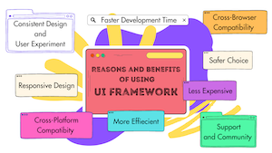

*Why learning bootstrap 5 is Worth the Climb?.*

First time I used boostrap, I thought why I have to use this? and Why I only can not use HTML or CSS? Why I have to learn more complex stuff? I did not even know that container-fluid, or colum and row stuff.... I even thought that is way faster just using CSS. However, I changed myt mind after using bootstrap few times. This was a big tool for making whole project way effecient. 
Not only for website looks.

## The free of HTML and CSS 

If I only used HTML and CSS, Making details would be so fun and you can even adjust Layout each pixel. But how long it takes? How hard it is? Time is limited. And bootstrap provide us the whole organized framework. Even thought, the command is hard to remember but if you remember, the time will be way less to make a project.  

## The benefit of UI framework
UI frameworks like Bootstrap not only make things look good, but also provide practical benefits for software engineers, such as     

Consistency: Class names written according to the same rules ensure that styles do not fall apart during team development.     

Responsive support: the display on smartphones, tablets, and PCs can be easily adjusted.     

Maintainability: Organized structure makes it easy to modify and reuse code.     

Extensive documentation and support: If you have any problems, you can quickly solve them through the official documentation or Stack Overflow.

