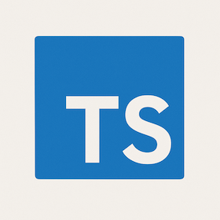

## Connection with JavaScript and TypeScript.

JavaScript	&nbsp;&nbsp;&nbsp;&nbsp;&nbsp;&nbsp;                TypeScript 
Dynamically typed	         &nbsp;&nbsp;&nbsp;&nbsp;&nbsp;&nbsp;          🔒 Statically typed variables, parameters 
No interfaces or enums	   &nbsp;&nbsp;&nbsp;&nbsp;&nbsp;&nbsp;          ✅ Interfaces, Enums, Type Aliases 
No compile-time checks	      &nbsp;&nbsp;&nbsp;&nbsp;&nbsp;&nbsp;       🧠 Compile-time error checking 
Poor tooling for large projects	  &nbsp;&nbsp;&nbsp;&nbsp;&nbsp;&nbsp;   🧰 Autocomplete, refactoring, and IDE support 
Loosely structured	           &nbsp;&nbsp;&nbsp; &nbsp;&nbsp;&nbsp;     🏗️ Classes with access modifiers (public, private, protected) 

## WODs

Athletic software engineering requires a high level of accuracy, deep knowledge, and strong problem-solving skills. There isn’t just one way to approach a problem and reach a solution. That’s why practicing WODs (Workouts of the Day) is so valuable—not only for athletic software engineering but also for programming in general.

What I like about the WOD style is that it allows me to focus on small programs while using a timer, which I find to be a very effective learning method. It helps me stay focused and build confidence through repetition.

At the same time, working on WODs can be stressful for me because even small problems can be very challenging. However, I believe that once I get used to doing WODs regularly, they will definitely become a powerful part of my learning routine.

## How I felt about learning Type Script

Learning type script is really important I feel. However, it is really hard for me to learn quiclly, so I need more time to master this laungage. I also think JavaScript is really important to learn TypeScript because grammar and how to code is simmilar and connected to TypeScript. 

